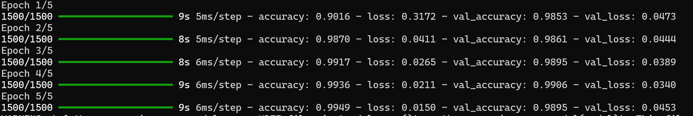
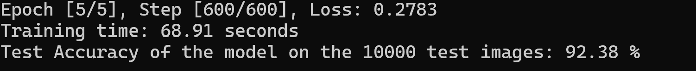
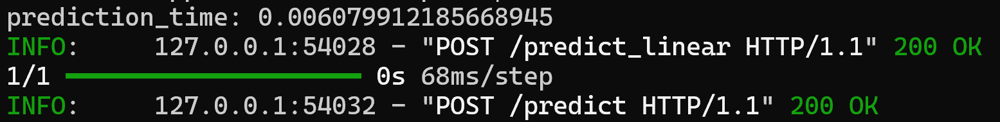

# Introdução

Projeto feito para desenvolver redes neurais, uma convolucional e uma linear, capazes de analisar números escritos a mão utilizando mnist. Foi desenvolvido dois modelos de rede neural: `linear.py` e `train.py`. A diferença de cada um é que o `linear.py` é a rede linear e o `train.py` é a rede convolucional.

[Vídeo de demonstração](https://youtu.be/5XX2pkfhfxo)

# Comparação dos modelos





## Velocidade

Baseado nas imagens acima, o tempo de treinamento da rede convolucional é bem menor do que a da rede linear sendo apenas 43 segundos comparado aos 69 segundos de treino da rede linear.

## Acurácia

Além da rede convolucional ser treinada mais rápida, ela também apresenta uma porcentagem de acurácia maior, sendo 98% comparado aos 92% da rede linear.

## Tempo de inferência



Baseado na imagem acima, pode ser notado que o tempo que o modelo linear demora para inferir o resultado é cerca de 10x mais rápido que o modelo convolucional.

# Como rodar

Para rodar o projeto, siga os seguintes passos:

1. Clone o repositório:
    ```bash
    git clone https://github.com/MarioVenturaMedeiros/Neural-XOR.git
    cd Neural-XOR
    ```

2. Crie um ambiente virtual e ative-o:
    ```bash
    python3 -m venv venv
    source venv/bin/activate
    ```

3. Instale os requisitos:
    ```bash
    pip install -r requirements.txt
    ```

4. Execute o frontend:
    ```bash
    cd src/frontent
    npm i
    npm start
    ```

5. Execute o backend:
    ```bash
    cd ..
    cd backend
    uvicorn main:app --reload
    ```

Note que os comandos acima estão assumindo que o usuário está usando Linux. Caso esteja usando Windows, substitua `python3` por `python` e `venv/bin/activate` por `venv\Scripts\activate`.